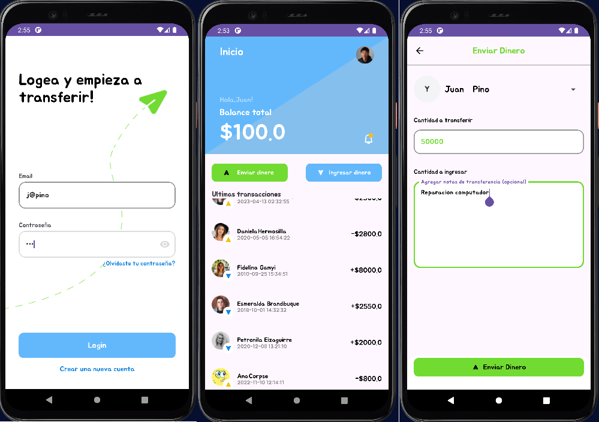
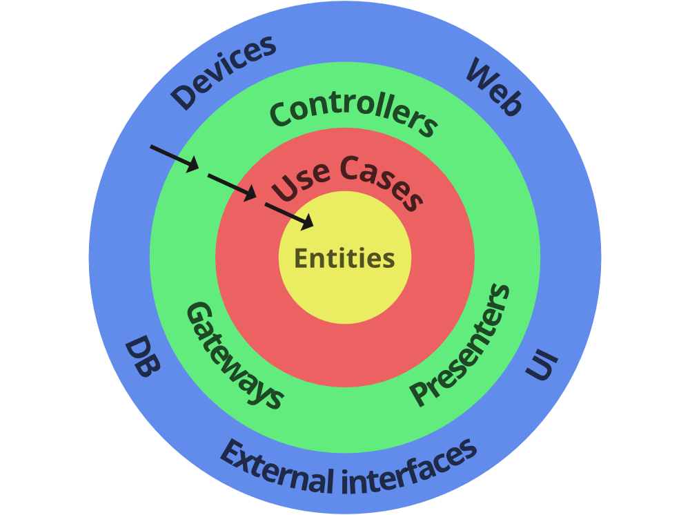
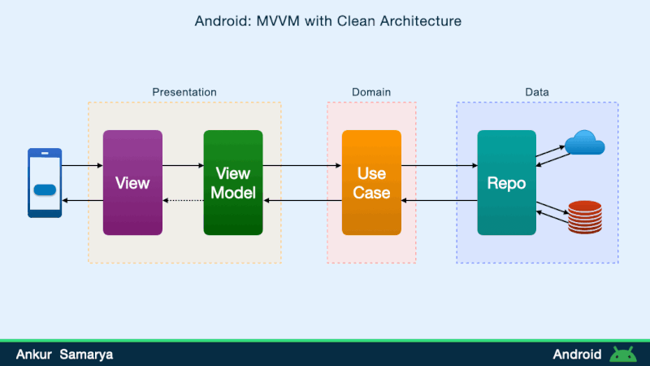

<div align="center">
  <br>
    <h2><strong>VirtualWallet</strong> </br>  </h2>
    <span>Evaluacion Integradora Modulo 5 Ciclo de vida - Arquitectura</span><br>
    <span>Juan Pino Contreras.</span>
</div>

****



## 🤓Notas del desarrollador:
- Usuario de prueba: 
  - Correo: `j@pino`
  - Contraseña: `123`
- Al hacer click en la _foto de perfil_ se mostrara la ventana Profile
- En las pantallas _Request Money_ y _Send Money_, la flecha hacia atrás del MaterialToolbar ubicado en la parte superior, envia al usuario devuelta al _Home_.
- En las pantallas _Request Money_ y _Send Money_ al hacer click en el nombre despliega un spinner con la lista de usuarios.

****
## 💸 VirtualWallet
<div align="center">
    
    
</div>


En este proyecto se representan conceptos aprendidos sobre el ciclo de vida de una aplicacion y la metodologia para la persistencia de datos a traves de este. Se focaliza especialmente en el uso del View Model y la arquitectura MVVM (Model View ViewModel) que le hace referencia. 

El desafio especial en este proyecto es pasar datos entre clases u objetos que representan las capas de la Clean Architecture. 
Los datos de un usuario correctamente logeado, deben persistir y ser coherentes y presentadas en las pantallas de la app y cambios del dispositivo.



## 🛠️Tecnologías y Herramientas Utilizadas
  - Android Studio Jellyfish | 2023.3.1
  - Virtualizado en Pixel 4 XL Api 30
  - Logcat

#### Gradle
- Dependencias:
  - **ViewModel**: Gestión del estado y datos del UI, manteniendo su consistencia a través del ciclo de vida de la actividad.
  - **LiveData**: Observación de datos para actualizaciones automáticas en la interfaz de usuario.
  - **Navigation**: Componentes de navegación para la gestión de fragmentos y transiciones.

#### Componentes de UI
- **RecyclerView**: Para la lista de transacciones y usuarios.
- **Spinner**: Para la selección de usuarios en las pantallas de solicitud y envío de dinero.
- **BaseAdapter**: Utilizado inicialmente para adaptadores personalizados.
- **Adapter.ViewHolder**: Utilizado en conjunto con RecyclerView para mejorar la eficiencia del manejo de vistas.

## 📚Estructura del Proyecto

El proyecto está estructurado siguiendo la arquitectura MVVM:

1. **Model**: Define los datos de la aplicación. En este caso, incluye clases como `Usuario`, `Transaction`, y `Account`.
2. **View**: La interfaz de usuario que incluye fragmentos y actividades como `HomePageFragment`, `TransactionReceive`, y `TransactionSend`.
3. **ViewModel**: Maneja la lógica de la interfaz de usuario y comunica entre el Modelo y la Vista. `WalletViewModel` es el principal ViewModel de la aplicación.

### Ejemplo de Código

#### WalletViewModel

```kotlin
class WalletViewModel : ViewModel() {


    private val _usuarios = MutableLiveData<MutableList<Usuario>>()
    private val _transactions = MutableLiveData<MutableList<Transaction>>()
    private val _accounts = MutableLiveData<MutableList<Account>>()

    val usuarios: LiveData<MutableList<Usuario>> get() = _usuarios
    val transactionsLD: MutableLiveData<MutableList<Transaction>> get() = _transactions
    val accountsLD: MutableLiveData<MutableList<Account>> get() = _accounts
    val usuarioConectado: LiveData<Usuario> get() = _usuarioConectado

    private val _usuarioConectado = MutableLiveData<Usuario>()

    init {
        _usuarios.value =  UsuariosDataSet().getAllUsuarios()
        _transactions.value = TransactionDataSet().getTransactionList()
        _accounts.value = AccountDataSet().getAllAccounts()
    }


    fun setUsuarioConectado(usuario: Usuario) { 
        _usuarioConectado.value = usuario
    }


    fun autenticarUsuario(email: String, password: String): Usuario? {
        val usuario = _usuarios.value?.find { it.email == email && it.contrasena == password }
        if (usuario != null) {
            setUsuarioConectado(usuario)
            return usuario
        } else {
            return null
        }
    }

    fun getUserImageResource(userId: String): Int {
        return when (userId) {
            "User01" -> R.drawable.pp3
            "User02" -> R.drawable.pp2
            "User03" -> R.drawable.pp1
            "User04" -> R.drawable.pp4
            "User05" -> R.drawable.pp5
            else -> R.drawable.pdefault 
        }
    }

    fun getBalanceForUser(userId: String): Double {
        return _accounts.value?.find { it.user_id == userId }?.balance ?: 0.0
    }
} 
```


## 📃Conclusiones
Se destaca la importancia de la arquitectura MVVM y cómo ayuda a manejar de manera eficiente la lógica de negocio y la interfaz de usuario en aplicaciones complejas. Además, muestra el uso de componentes esenciales de Android como ViewModel, LiveData, y RecyclerView para crear una aplicación robusta y escalable.

## 🔩 Requisitos

1. **Configuración del Entorno**:
   *Java Development Kit (JDK)*
    - Android Studio requiere el JDK para compilar y ejecutar aplicaciones. Asegúrate de tener instalada una versión compatible del JDK

2. **Descarga y Clonación**:
   - Clona este repositorio en tu máquina local utilizando Git:
     ```bash
     git clone https://github.com/Jvbass/VirtualWalletArqLifeCycle
     ```
3. **Android Studio**
    - Debes tener instalado Android Studio en tu sistema. Descargalo y abre el proyecto navegando a la carpeta donde lo clonaste.
4. **Depedencias**
  - Las dependencias estan incluidas en el proyecto, pero no esta demas asegurarte que todo este bien configurado en el archivo build.gradle.kts (Module:app y Project)
## 🤝 Contribuciones

¡Las contribuciones siempre son bienvenidas! Si tienes ejercicios adicionales, mejoras en las soluciones existentes o cualquier otro aporte que creas que pueda beneficiar a otros usuarios, no dudes en abrir un [_pull request_](https://github.com/Jvbass/VirtualWalletArqLifeCycle/pulls) o contactarme.

#### _Gracias por tu interés en este proyecto. Si tienes algun comentario o duda sobre este o cualquier otro proyecto no dudes en contactarme._
###### ¡Espero tus _PR_!👋
